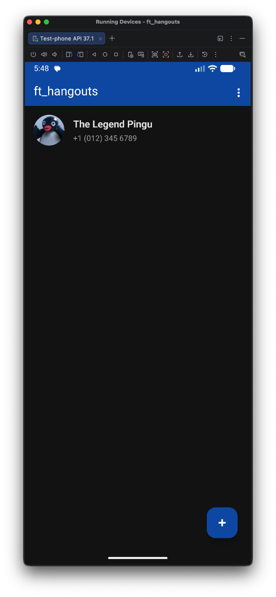
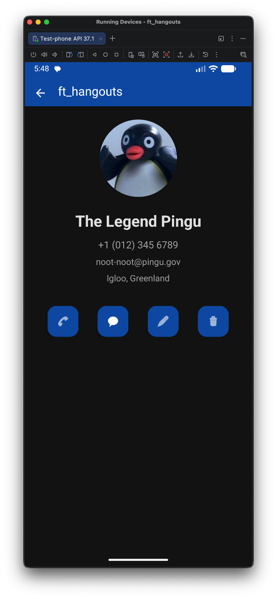
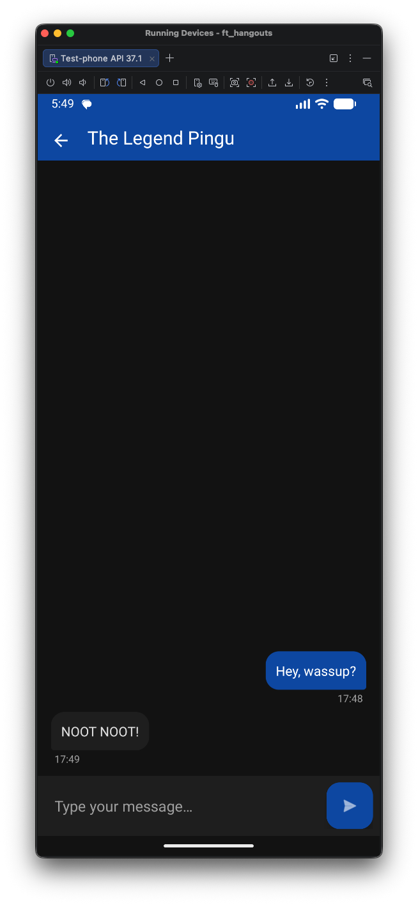

 

# ft_hangouts - Phonebook

 

### Sommaire

- [Objectifs du projet](#objectifs-du-projet)
- [Fonctionnalités principales](#fonctionnalités-principales)
- [Captures d'écrans](#captures-décrans)
- [Stack](#stack)
- [Références](#références)
- [Grade](#grade)

 

### Objectifs du projet

- Découvrir le développement mobile natif sur Android
- Comprendre le cycle de vie d'une application et ses interactions avec l'OS
- Gérer une base SQLite locale, sans toucher aux contacts du système
- Manipuler les permissions Android (SMS, appels, stockage)
- Gérer les changements de configuration : rotation d'écran, langue du système
- Faire tout ça sans aucune librairie externe

 

### Fonctionnalités principales

- Créer, modifier et supprimer un contact (5 champs minimum)
- Liste des contacts sur la page d'accueil, avec un résumé pour chacun
- Fiche détaillée au clic sur un contact
- Stockage persistant dans une base SQLite propre à l'application
- Envoi et réception de SMS depuis l'app
- Historique de conversation, avec distinction entre émetteur et destinataire
- Menu pour changer la couleur du header
- Application en français et en anglais, suit la langue du système
- Toast au retour au premier plan, avec l'heure de la dernière mise en arrière-plan
- Modes portrait et paysage supportés
- Icône du logo 42

**Bonus (tous réalisés) :**

- Photo de profil pour chaque contact
- Création automatique d'un contact quand un SMS arrive d'un numéro inconnu
- Appel direct d'un contact depuis l'application
- Interface soignée, basée sur les principes du Material Design

 

### Captures d'écrans

 

### Stack 

- **Android Studio**
- **Kotlin**

 

## Références

- Sujet officiel [ici en pdf](docs/subject.pdf) ou [ici en markdown](docs/subject.md)

 

## Grade

> En cours de révision

<!--  -->

 

This work is published under the terms of **[42 Unlicense](LICENSE)**.
